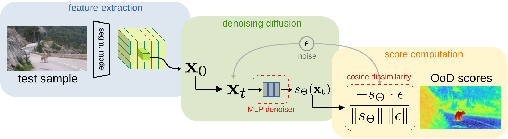

 <!-- # [ECCV 2024] Diffusion for Out-of-Distribution Detection on Road Scenes and Beyond 
[Paper](https://arxiv.org/abs/2407.15739) 
 -->

<div align="center">
<h1> [ECCV 2024] Diffusion for Out-of-Distribution Detection on Road Scenes and Beyond</h1>
<div align="center">
<!-- <h3>
  <a href="https://arxiv.org/abs/2407.15739">Paper</a> | <a href="https://ade-ood.github.io/">ADE-OoD Benchmark</a>
</h3> -->
<p align="center">

</p>
</div>
</div>
<div align="center">
  <a href="https://lmb.informatik.uni-freiburg.de/people/galessos/">Silvio Galesso</a>, <a href="https://lmb.informatik.uni-freiburg.de/people/schroepp/">Philipp Schröppel</a>, Hssan Driss, <a href="https://lmb.informatik.uni-freiburg.de/people/brox/">Thomas Brox</a>
</div>
<div align="center">
  University of Freiburg
</div>
<br>
<br>

This repository contains the official implementation of **DOoD**, a method for out-of-distribution detection on segmentation data with a focus on *domain generality*.

For the **ADE-OoD benchmark**, introduced in the same paper, see the [project page](https://ade-ood.github.io/)

## :wrench: Setup
Our code is based on the [MMSegmentation](https://github.com/open-mmlab/mmsegmentation) toolbox by OpenMMLab.

### Environment
After creating the conda environment:
```
conda create -n dood python=3.11
conda activate dood
```
Install pytorch with:
```
pip install torch torchvision torchaudio --index-url https://download.pytorch.org/whl/cu118
```
Install mmsegmentation (tested with `mmcv` version `2.1.0`) with:
```
pip install openmim
mim install mmengine
mim install "mmcv==2.1.0"
```
or follow the [mmsegmentation installation guide](https://github.com/open-mmlab/mmsegmentation/blob/main/docs/en/get_started.md).
Install the other necessary packages with:
```
pip install -r requirements.txt
```

### Datasets
* The `configs/datasets/test` folder contains the configuration files for the test benchmarks.
* The `configs/datasets/reference` folder contains the configuration files for the reference datasets, used by DOoD to normalize the anomaly scores.
Modify the `data_root` string in the data configuration files (`configs/datasets`) to point to the location of the dataset on your file system.
If needed, set the `ood_index` value to the out-of-distribution class ID in the test configuration.

### Models
Here are the download links for the trained models. The corresponding configuration files can be found in `configs/models`.

##### Trained on ADE20k
To be used with the ADE-OoD benchmark.

| Model architecture | Training dataset | Segmentation | Diffusion |
| -------- | ------- | -------- | ------- |
| SETR ViT-L  |  ADE20k           | [weights](https://lmb.informatik.uni-freiburg.de/resources/binaries/eccv24_dood/setr_vit-l_ade20k_segm.pth)|[weights](https://lmb.informatik.uni-freiburg.de/resources/binaries/eccv24_dood/setr_vit-l_ade20k_diff.pth) |

##### Trained on Cityscapes
To be used with road-scenes benchmarks, such as RoadAnomaly, SegmentMeIfYouCan, or Fishyscapes.
| Model architecture | Training dataset | Segmentation | Diffusion |
| -------- | ------- | -------- | ------- |
| Segmenter ViT-B  |  Cityscapes  |[weights](https://lmb.informatik.uni-freiburg.de/resources/binaries/eccv24_dood/segmenter_vit-b_cityscapes_segm.pth) |[weights](https://lmb.informatik.uni-freiburg.de/resources/binaries/eccv24_dood/segmenter_vit-b_cityscapes_diff.pth) |
| SETR ViT-L  |  Cityscapes       |[weights](https://lmb.informatik.uni-freiburg.de/resources/binaries/eccv24_dood/setr_vit-l_cityscapes_segm.pth) |[weights](https://lmb.informatik.uni-freiburg.de/resources/binaries/eccv24_dood/setr_vit-l_cityscapes_diff.pth) |

## :runner: Inference
To evaluate on **ADE-OoD**:
```
python evaluate.py --model_config configs/models/setr_vit-l_ade20k.py --test_data_config configs/datasets/test/ade_ood.py --segmentation_ckpt PATH/TO/setr_vit-l_ade20k_segm.pth --diffusion_ckpt PATH/TO/setr_vit-l_ade20k_diff.pth
```

To evaluate on **RoadAnomaly**:
```
python evaluate.py --model_config configs/models/segmenter_vit-b_cityscapes.py  --test_data_config configs/datasets/test/road_anomaly.py --segmentation_ckpt PATH/TO/segmenter_vit-b_cityscapes_segm.pth --diffusion_ckpt PATH/TO/segmenter_vit-b_cityscapes_diff.pth
```

To evaluate on **Fishyscapes Lost & Found**:
```
python evaluate.py --model_config configs/models/setr_vit-l_cityscapes.py  --test_data_config configs/datasets/test/fishyscapes_laf.py --segmentation_ckpt PATH/TO/setr_vit-l_cityscapes_segm.pth --diffusion_ckpt PATH/TO/setr_vit-l_cityscapes_diff.pth
```

...and so on with other combinations of `--model_config`, `--test_data_config` and model checkpoints.

Other inference options include:
* `--save_dir`: the directory to save the scores to. If not specified, the scores will not be saved.
* `--num_diffusion_steps`: the number of denoising steps to use. More steps mean better performance (with diminishing returns) but also slower inference.
* `--diffusion_score_fn`: the type of scoring function to use, among `eps_cos` (cosine dissimilarity in the noise space), `eps_mse` (L2 distance in the noise space), `recon_mse` (L2 distance in the image space).
* `--reference_data_config`: to override the model's reference data configuration.

**Disclaimer:** the results can vary due to the stochasticity of the denoising process. Moreover, the models were trained using an earlier version of pytorch. Porting them to a newer seems to cause some minor numerical discrepancies.

## :mortar_board: Citation
```
@inproceedings{GalessoECCV2024,
    Title = {Diffusion for Out-of-Distribution Detection on Road Scenes and Beyond},
    Author = {Silvio Galesso and Philipp Schr\"oppel and Hssan Driss and Thomas Brox},
    Booktitle = {ECCV},
    Year = {2024}
}
```